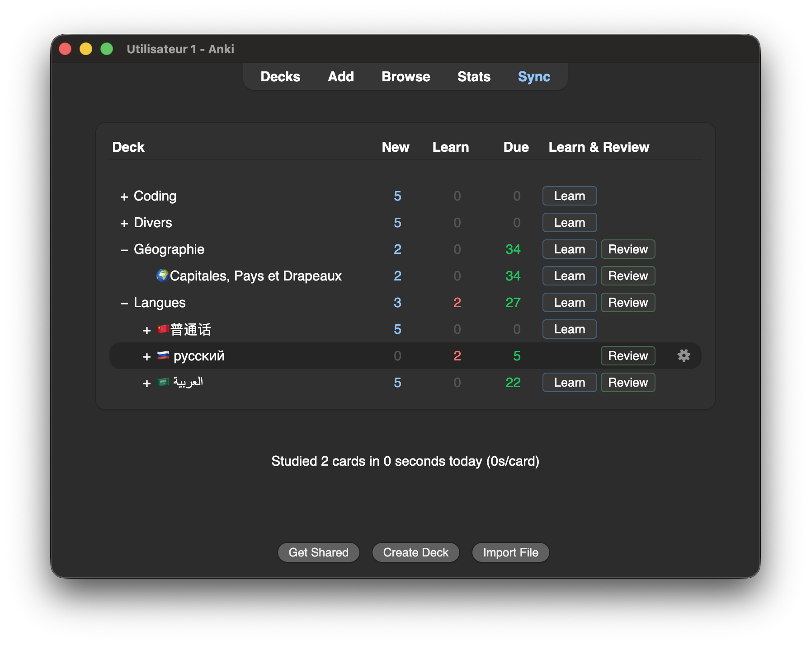

# Learn & Review

An Anki add-on that adds separate **Learn** and **Review** actions to the Deck Browser.

## Why?

By default, Anki provides a single **Study** action for a deck. That session can include both new cards and review cards depending on what is available.

This add-on separates these two workflows:

* **Learn** — starts a session dedicated to new cards available for learning. Each new card is introduced once through the learning process.
* **Review** — starts a session for cards already in the learning/relearning/review cycle.

This makes it possible to explicitly choose what you want to work on instead of letting the standard Study session mix both.



## Installation

The add-on is not yet published on AnkiWeb. For now, it can be installed manually from the releases available on the [Releases page](../../releases).

1. Download the latest release.
2. Extract the archive.
3. Copy the add-on folder into Anki's `addons21` directory.
4. Restart Anki.

The `addons21` directory is located at:

* **Windows:** `%APPDATA%\Anki2\addons21`
* **macOS:** `~/Library/Application Support/Anki2/addons21`
* **Linux:** `~/.local/share/Anki2/addons21`

### How to build

To package the add-on into a distributable `.zip` file, run the build script:

```bash
python3 build.py
```

The resulting zip file will be generated in the `dist/` directory.

## Technical approach

The add-on does not implement its own scheduler.

It uses Anki's native **V3 scheduler** and its existing scheduling rules, card states and daily limits.

It does **not**:

* increase or bypass daily card limits, unlike some existing add-ons that modify or work around these limits;
* modify deck options;
* change Anki's scheduling algorithm;
* alter card states to make additional cards available.

The add-on provides a separate entry point into Anki's existing scheduling system while keeping Anki's native scheduling behavior intact.

## Support

This add-on is completely free and open-source. If you find it valuable, you can support its development with a pay-what-you-want contribution!

[](https://ko-fi.com/yougo)

## License

This project is licensed under the **GNU Affero General Public License v3.0 (AGPLv3)**.

See [`LICENSE`](LICENSE) for the full license text.
